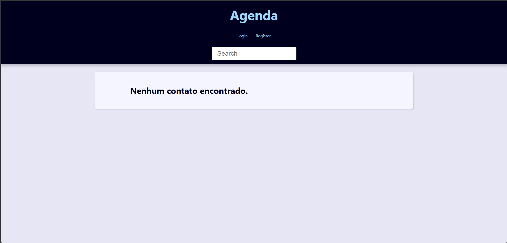
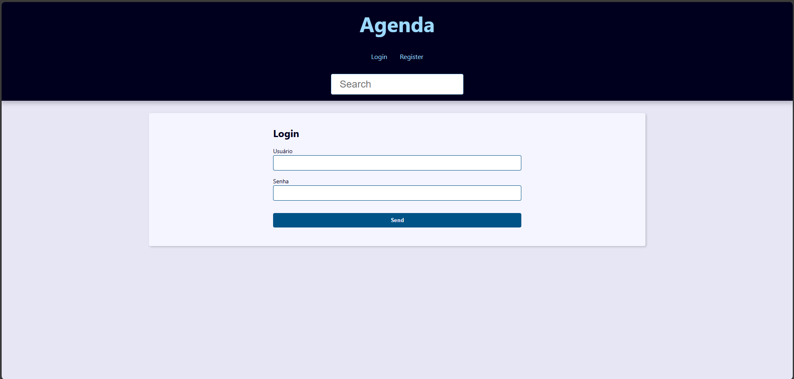
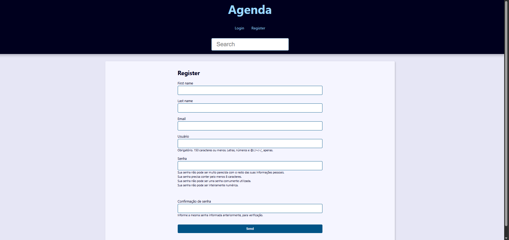
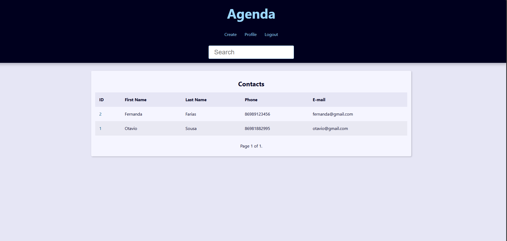
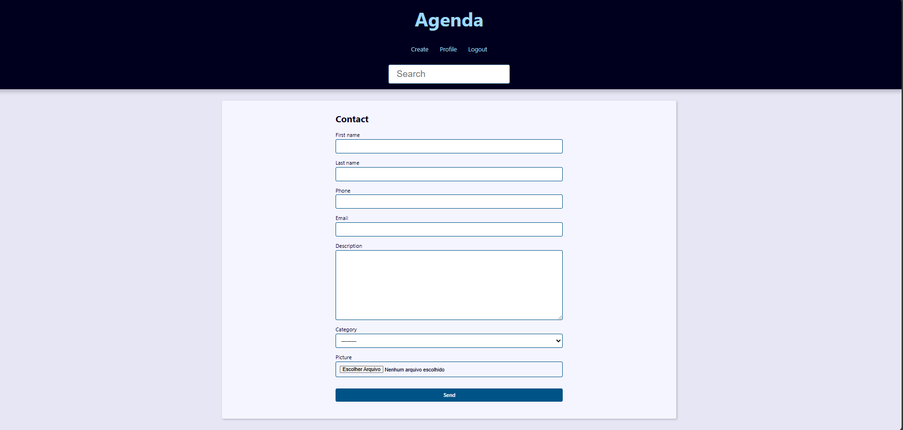
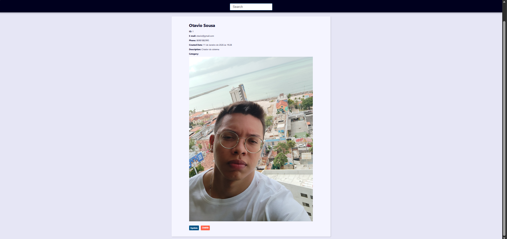
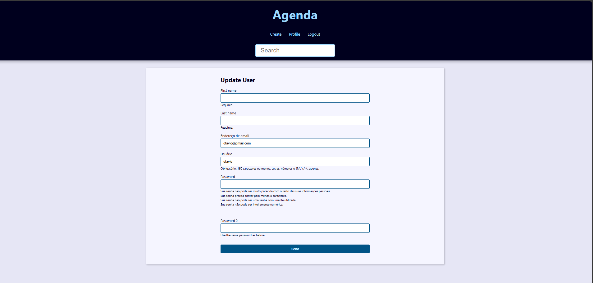
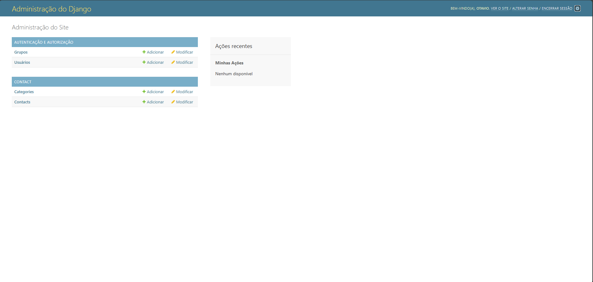
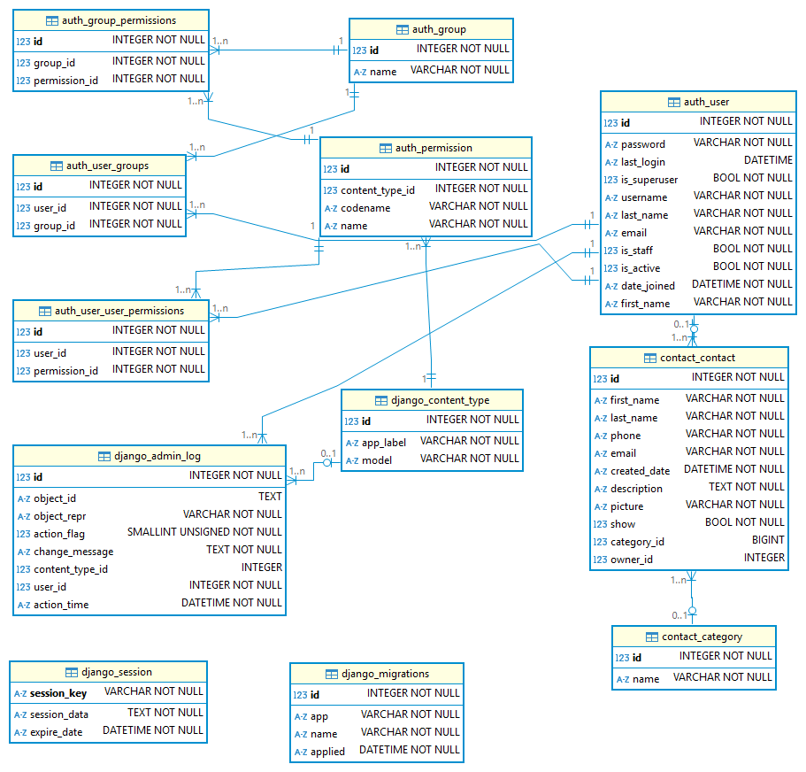

# Projeto Agenda de Contatos Django

Uma aplicação web para gerenciar uma agenda de contatos desenvolvida com Django.

## Site Hospedado

Acesse a aplicação em [Agenda](https://agendaotaviossousa.pythonanywhere.com)

## Funcionalidades

- ✅ Registro de usuários
- ✅ Login e logout
- ✅ CRUD de contatos (criar, ler, atualizar e deletar)
- ✅ Busca de contatos
- ✅ Paginação de contatos
- ✅ Upload de imagens para contatos
- ✅ Categorização de contatos
- ✅ Perfil de usuário

## Estrutura do Projeto

- `base_static/`: Arquivos estáticos globais (CSS, JS, imagens)
- `base_templates/`: Templates HTML globais
- `contact/`: Aplicação principal com models, views, forms e templates específicos
- `core/`: Configurações e URLs do projeto
- `media/`: Diretório para upload de arquivos
- `static/`: Diretório para arquivos estáticos coletados
- `utils/`: Scripts utilitários

## Scripts Utilitários

- `utils/create_contacts.py`: Cria contatos aleatórios para testes

## Telas do Sistema

### Tela Inicial

### Login

### Registro de Usuário

### Usuário Logado

### Criar Contato

### Dados do Contato

### Perfil do Usuário

### Painel Administrativo

### Diagrama ER

## Como Executar

1. Clone o repositório
2. Crie um ambiente virtual: `python -m venv venv`
3. Ative o ambiente: `.\venv\Scripts\activate` (Windows)
4. Instale as dependências: `pip install -r requirements.txt`
5. Execute as migrations: `python manage.py migrate`
6. Crie um superuser: `python manage.py createsuperuser`
7. Inicie o servidor: `python manage.py runserver`
8. Acesse em `http://127.0.0.1:8000/`
